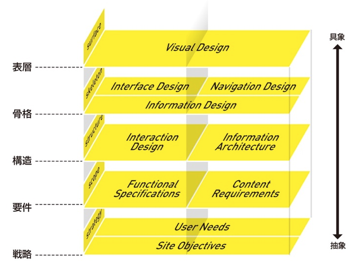
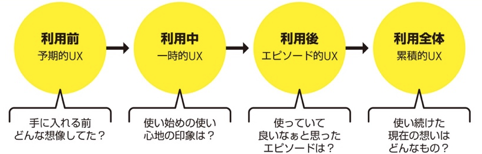

# はじめに

今回は「[はじめての UX リサーチ](https://www.amazon.co.jp/%E3%81%AF%E3%81%98%E3%82%81%E3%81%A6%E3%81%AEUX%E3%83%AA%E3%82%B5%E3%83%BC%E3%83%81-%E3%83%A6%E3%83%BC%E3%82%B6%E3%83%BC%E3%81%A8%E3%81%A8%E3%82%82%E3%81%AB%E4%BE%A1%E5%80%A4%E3%81%82%E3%82%8B%E3%82%B5%E3%83%BC%E3%83%93%E3%82%B9%E3%82%92%E4%BD%9C%E3%82%8A%E7%B6%9A%E3%81%91%E3%82%8B%E3%81%9F%E3%82%81%E3%81%AB-%E6%9D%BE%E8%96%97-%E7%BE%8E%E5%B8%86/dp/4798167924)」という本を読んでみたので、学んだ内容等を紹介しようと思います。

# 本の紹介

本書は、これから現場に UX リサーチ(=UX デザイン)を組み込みたいと考えているプロダクトマネージャー、デザイナー、エンジニアなど様々な職種の人に向けたものとなっています。  
なのでそもそも UX リサーチってどういうものなのか、どのように道筋を立てて実践していけば良いかなどが記載されており、UX リサーチの入門書のような位置づけとなっております。

また著書はメルペイで UX リサーチャーとして業務しており、社内に UX リサーチを浸透させるための取り組みや、実際のプロジェクト事例をもとにどのように UX リサーチを実践したのかなどの紹介もされています。

# 本書を読んでみようと思ったきっかけ

私は今までの業務で「ユーザビリティテスト」や「エキスパートレビュー」の 2 つの UX リサーチ手法を経験してきました。この 2 つの手法でも確かにユーザビリティの向上を行うことができますが、UX リサーチの手法はその他にもたくさんあります。  
それらの手法はどのような状況で使うべきなのか、またどのように UX リサーチ手法を決めれば良いのかがよくわからないと思っていました。

そんなときに直近の業務でユーザビリティテストの実施をすることになり、改めてユーザビリティテストに関することだけでなく UX リサーチ全体の流れや組み立て方を学んで活かせればと思い、本書を読んでみることにしました。

# 学んだこと

本書を読んで、今後の業務でも活かせそうと思ったり、印象に残ったのが下記の 2 点です。

- 状況に応じて UX リサーチの手法を決める
- UX リサーチは一人でも始められる

## 状況に応じて UX リサーチの手法を決める

UX リサーチはプロジェクトの状況に応じて、手法が変わってきます。本書では UX を活用する状況の分け方をいくつか紹介しており、その中でも参考になったものを紹介します。。

### 1. 探索のリサーチ、検証のリサーチ

プロジェクトの状況が「探索」をした方が良いのか、「検証」をした方が良いのかを考えて、UX リサーチ手法を検討する分け方です。

#### ● 探索のリサーチ

探索のリサーチは、検証したい仮説が明確になく、何が課題なのか、何を解決すべきなのかを知るための調査です。その他に新規機能の追加や UI デザイン改修など、やりたいことがたくさんあるときに、何から取り組むべきか優先順位を付けるときにも探索の調査が適していると思います。  
「正しい問いを立てる」ために行うもので、ユーザーを深く理解できる「デプスインタビュー」がよく使う手法となります。ユーザーからの意見を聞くことで、新たな課題が明らかになったり、優先して解決する事が明確になったりします。

#### ● 検証のリサーチ

検証のリサーチは検証したい仮説が明確にあるときに実践します。課題を解決するための仮説(UI デザイン、機能など)はある状態で、それが実際にユーザーから支持されるかを確認します。このあたりがよく聞く「UX デザイン」のイメージに近いかと思います。自分が経験した業務もこのあたりが多かったです。  
ここでは「コンセプトテスト」や「ユーザビリティテスト」といった手法がよく活用されます。

この 2 つの分け方を読んでいて、「探索のリサーチ」を飛ばしてすぐに「検証のリサーチ」に入ってしまうことがよくありそうだと思いました。浮かんだ UI のアイディアの効果がありそうかなどをすぐに確認したくなりそうですが、それを試すにも工数はそれなりに掛かってしまいます。  
闇雲に試すのではなく、検証のリサーチの途中でも一度探索のリサーチを行ってユーザー理解を深めることも大切そうだなと思いました。

<!-- ### 2. 質的リサーチ/量的リサーチ

質的データを扱う「質的リサーチ」と、量的データを扱う「量的リサーチ」に分けます。質的データは数値では測定できず、演算ができないデータを指します。量的データはその逆を指します。

#### ● 質的リサーチ

質的リサーチでは、ユーザーは実際にどのようにどのような行動をしているのか、ユーザーの考えていることを調べるときに向いています。なのでデプスインタビューがよく活用されます。
しかしそのときにそのユーザーの意見がユーザー全体の意見と捉えると、全くの見当違いの可能性も出てきます。
なのであくまで質的リサーチは新たな解釈や発想を生み出すという目的で利用し、それらが正しいのかどうかを次の量的リサーチで確認するという流れが良さそうです。

#### ● 量的リサーチ

量的リサーチは、何がどのくらい起きているのかを調べるときに向いています。量的リサーチではアンケートの回答結果やログデータが活用されます。
まず市場に今のアイディアが受け入れられそうか確認したいときや、既にアンケート結果やログデータが蓄積されているときは、量的リサーチから始めてみるのが良さそうです。

質的リサーチと量的リサーチは、状況に応じてどちらを先にやるか決めて、必ずその後にもう一つのリサーチを実施するという方が、UX リサーチ活動を効果的に進められると感じました。 -->

### 2. UX の要素ごとのリサーチ

UX の構成要素を明確にして、どの要素について調べるか検討します。UX リサーチの対象は多岐に渡るので、全てをやろうとするとかなりのリソースが必要となります。  
なので自分たちの状況を踏まえて、UX の構成要素を分解してどこを重点的に調べるのかを判断すると良いです。

#### ● UX エレメント

UX エレメントは、UX の 5 段階モデルとして知られている「戦略」「要件」「構造」「骨格」「表層」を元に、どの段階を対象に UX リサーチを取り組むか検討します。

例えば新機能のアイディアがあるときは本当にそれがユーザーが欲しているか確認するために、「要件」の調査に力を入れます。調査手法としては簡単なプロトタイプを作成して、ユーザーインタビューするなどがあります。
5 段階にフェーズが別れていることで、自分たちがどこらへんを調査しきれていないかが整理しやすくなり、メンバー内や関係者感の認識共有もしやすくなると思います。

 

#### ● UX タイムスパン

UX を時間軸で「サービスを利用する前」「利用中」「利用後」「利用全体」に分けて調査する方法です。  
サービス開発をしていると、つい利用中のユーザーのことばかり考えてしまいそうになりますが、ユーザビリティを高めるためには利用前後のユーザーの状況も把握することは大切なので、このように時間軸に分けると新たに調査が必要なことが見つかるかもしれません。

 

この「UX の要素ごとのリサーチ」は「探索のリサーチ、検証のリサーチ」よりも、図を用いながら詳しく現状を整理できるので関係者間で認識を合わせたい場合や、UX リサーチの必要性を説得するときに使うと良いと感じました。図があるので説明される方も必要性を理解しやすそうです。

反対に１人、もしくは少人数でとりあえず UX リサーチをやってみるという場合は、「探索のリサーチ、検証のリサーチ」を用いた方がスムーズに UX リサーチを実施するところまでいけるような気がしました。

## UX リサーチは一人でも始められる

UX リサーチというと、高い専門性が求められたり、多くのリソースを使って調査するというイメージがあったりと、なかなか簡単には手を出しづらく感じると思います。
しかし本書の中では、UX リサーチを一人でも始めて徐々に関わる人を増やしていく方法を、著者の実体験とともに紹介しています。

一人や少人数で UX リサーチを始めてみる場合、気をつける点は以下の通りです。

### 小さく始める

最初のうちは協力してくれる人や自分の時間を確保することも難しいので、小さく始める意識を持つことが重要です。例えばサービスに関して身近な人に 20~30 分ほど聞いてみるなどです。それだけでも新たな気づきが見つかる可能性は十分にあります。
社内の関係者の調整や上司の承認などが必要のない範囲で始めてみると良さそうです。

小さく始めることの利点は、自分が何の UX スキルが足りないかを知ることもできるので、そこからどの UX リサーチ手法を学んでいくか決められるのも挙げられると思います。  
UX リサーチ手法はそれぞれに専門の本があるくらいなので、学習の方向性を決められるのは助かると思いました。

### 表層、骨格から取り組む

UX エレメントで説明した 5 段階モデルの上部「表層」「骨格」を対象にしたほうが、UX リサーチを始めやすいです。「表層」「骨格」はサービスの画面(UI、ビジュアルデザイン)に関することなので具体性があり、ユーザーに対して検証やインタビューがしやすいフェーズです。課題を見つけて改善するまでをスピーディーに行えるので、良い実績作りになります。

5 段階モデルの下部の「戦略」「要件」は抽象度が高いため、UX リサーチの中では難易度が高い分野となります。どの手法を使って調査するか、またその調査結果をどのように活かすかを考えることは、UX リサーチのスキルや経験値が求められることなので、最初に取り組むには向いていないです。

# 本書を読んだ感想

本書を読んでみて、いざ UX リサーチに取り組むとなったときに、何から始めれば良いか、UX リサーチの全体像と一連の流れを理解できたかなと思います。
本書はこの他に UX リサーチの各手法の説明やメルペイでの事例なども紹介しているので、UX リサーチの入門書としてぜひ読んでみてください。
