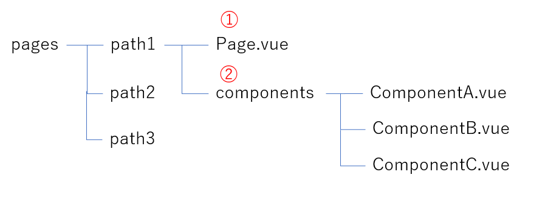

## はじめに
現在の案件でVueを使用したフロントエンド開発を行っています。
その中で画面や機能の増加に伴いVueコンポーネントファイルも大量に増えたため、改めてVueプロジェクトのフォルダ構成を検討することになりました。


検討するにあたり、VueやReactのフォルダ構成について調査を行ったので、その内容や最終的に考えたフォルダ構成について紹介したいと思います。


## 現状のフォルダ構成
現状のVueコンポーネントが格納されているフォルダは下記の通りです。Vueコンポーネントに関する情報のみ抜き出しています。
```
src
├── components　
│    ├── XXXX.vue
│    └── XXXX.vue
|    ︙
├── views // 画面表示のコンポーネント格納
|    ├── Login.vue
|    └── Top.vue
|    ︙
│
└── App.vue // ルートコンポーネント
```
src直下に`views`フォルダと`components`フォルダ、そしてルートコンポーネントのApp.vueがおかれています。  
viewsフォルダ内には各画面を表示するVueコンポーネント(画面コンポーネント)が格納されています。URLのパスごとに作成しているので、画面数分あります。  
componentsフォルダには画面の一部を表示するVueコンポーネント(入力欄やボタン、表など)が格納されています。基本的にviewsフォルダに格納されている画面コンポーネントから呼び出して利用します。

この2種類のフォルダしかないため、画面や機能の増加によりどちらのフォルダ内も大量のVueコンポーネントが格納されています。
そのため、Vueコンポーネント同士の関連性が把握しづらく、どこにどのようなロジックが書かれているかも推測しづらい状況になっています。


## SPAのフォルダ構成の基礎
フォルダ構成を検討する前に、一般的なSPAのフォルダ構成についてお話します。  

まず前提としてSPAのフォルダ構成は、特にこれといった決まりはありません。Reactの公式ドキュメントでは、プロジェクトの状況や開発者の好みに応じて決めることを推奨しており、もし決められないのならば最初のうちは適当でも良いと言っています。([React:ファイル構成](https://ja.reactjs.org/docs/faq-structure.html))

そのような中で、多くの現場で使われている考え方として「コンテナコンポーネント」と「プレゼンテーショナルコンポーネント」にコンポーネントを分離する方法があります。  
参考：[Presentational and Container Components](https://medium.com/@dan_abramov/smart-and-dumb-components-7ca2f9a7c7d0)  
これは上記の記事はReact/Reduxについて書かれていますが、Vue/Vuexにも適用できます。 

各コンポーネントの役割は以下のとおりです。役割的にコンテナコンポーネントが「親」、プレゼンテーショナルコンポーネントが「子」となります。  
`コンテナコンポーネント`
- 状態管理ライブラリ(Redux/Vuex)とやりとりを行う
- コンポーネント内で状態を保持し、状態を変更するためのロジックを持つ
- API通信を行う
- プレゼンテーショナルコンポーネントを利用して構成される
- CSSはプレゼンテーショナルコンポーネントの配置に関することを記述(flexbox、marginなどのレイアウト指定)

`プレゼンテーショナルコンポーネント`
- 基本的にコンテナコンポーネントから渡されたpropsを描画するだけ
- 場合によってはdataを持つことも可（表示非表示フラグなど）
- API通信は行わない
- データ操作のロジックは持たず、変更する場合はContainerコンポーネントに依頼する
- CSSはそのコンポーネント自身に関することのみ(文字の大きさ、色など)


この2つのコンポーネントに分けることで、以下のメリットが挙げられます。
- 画面の見た目を変更するときや、データ構造が変わったりしたときに、修正するファイルが明確になる
- 状態変更の流れが一方向に統一でき(親⇒子)、思わぬバグの発生を防ぐことができる
- プレゼンテーショナルコンポーネントはStorybookなどでUIカタログ化しやすい
- propsから受け取った情報を表示するだけなので、プレゼンテーショナルコンポーネントの共通化がしやすくなる


最近ではReactの[Hooks](https://ja.reactjs.org/docs/hooks-intro.html)やVueの[Composition API](https://v3.ja.vuejs.org/api/composition-api.html)が登場したことで、状態管理ライブラリとのやりとりがしやすくなったり、コンポーネントファイルからロジック処理を別ファイルに分離しやすくなったため、コンテナコンポーネントとプレゼンテーショナルコンポーネントは意識しなくて良いと`Presentational and Container Components`を執筆した著者が言っていますが、フォルダ構成を考える場合はこの考え方をベースにした方がルール作りがしやすいため今でも用いられることが多いです。

なので今回フォルダ構成を検討する際も、この考え方をベースにしています。


## フォルダ構成の検討にあたり意識すること
フォルダ構成を検討するにあたり、以下の2点を意識しました。
- 責務の分離  
前述したコンテナコンポーネントとプレゼンテーショナルコンポーネントの考え方を取り入れてコンポーネントごとの責務の分離を行います。  
さらにフォルダ構成によってコンポーネントの中身を見なくても、どれがコンテナコンポーネントでどれがプレゼンテーショナルコンポーネントかを推測しやすくなるようにしたいと思いました。  

- 格納場所を迷わない  
フォルダ構成やルールを細かくしすぎると、格納場所に迷ったり認識のズレによって違う場所にファイルが格納されたりします。  
厳密なルールでも運用できている事例もありますが、今回はフロントエンド開発経験が浅くても理解できるような範囲で検討しました。


また今後の運用の話でもありますが、「コンポーネントの共通化」は重要視しません。
SPAフレームワークの利点として、コンポーネントを細かく分割できるため共通化がしやすいことが挙げられます。
しかし明らかに共通化できるもの(ボタン等)を除き、最初から共通化を意識したコンポーネントを作成することは難しいです。機能拡張などが行われ、共通化したコンポーネントを別の場所でも使えるように修正するといった作業を行うと、ロジックが増えて複雑になってしまうからです。

開発者としては共通化をしたい気持ちに駆られますが、そこらへんはうまくバランスを見ながら開発していきたいと思っています。


それとファイルの命名や格納場所に困らないこと。Atomic Design等の説明は下の章で紹介する。
AtomicDesign、、、境目が分かりづらく、量のバラつきが出て結局もう少し粒度を粗くして整理する話もよく聞く。

## 今回検討したフォルダ構成の紹介
今回検討したフォルダ構成を説明します。  
まずVueファイルが格納されているルートフォルダ付近の構成は下図のようにしています。

<br />

① uiフォルダ  
ソースコード一式が格納されているsrc配下にuiフォルダを置きます。src配下にはVueファイルの他にvuex関連のフォルダやutils、assetsなども置かれているので、Vueファイルも1つのフォルダ内にまとめるためにuiフォルダを設けました。 

② pagesフォルダ
pagesフォルダ内には各画面を構成するVueファイルを格納します。pages配下にはURLのパスごとにフォルダを作成します。
ここの部分に関しては後述で詳しく説明します。

③ templatesフォルダ  
画面のレイアウト情報が記載されたVueファイルを格納します。ヘッダー、サイドメニューなど複数画面で固定表示するコンポーネントはここのVueファイルに記載します。  
レイアウト情報意外にも、全画面で共通の表示を行いたい場合もここに表示処理を記述します。例えばモーダル表示など。

④ commonsフォルダ  
ボタンなど複数画面で共通して使用するコンポーネントはここに格納します。  
commonsフォルダ内にさらにフォルダを作成することは現状は考えていないですが、もしコンポーネント数が増えた場合はコンポーネントのジャンル(button、input、modalなど)ごとにフォルダ分けしたり、[Atomic Design](https://atomicdesign.bradfrost.com/)のルールを一部取り入れたりするかもしれません。


### pagesフォルダについて
pagesフォルダは下図のような構成になります。

<br />

① Page.vue  
①にはURLのパス(path1)で表示される画面全体の表示処理を行うVueファイルを置きます。画面全体の表示を行うために、同じ階層のcomponentsフォルダ(②)から、様々なVueコンポーネントをimportして画面を組み立てます。  
前述した「コンテナコンポーネント」の役割を、このVueファイルが担います。フォルダ構成のルールを知っていれば、すぐにコンテナコンポーネントのファイルが見つけられるようにしています。  
今回の図では「Page.vue」という名前にしていますが、どこの画面のVueファイルか認識しやすいように、親フォルダのURLパス名と同じにした方が良いかと思います。

②componentsフォルダ  
componentsフォルダにはパス(path1)の画面を構成するVueコンポーネントを格納します。ここに格納されたVueコンポーネントは前述した「プレゼンテーショナルコンポーネント」の役割を担います。  
当初は格納するVueコンポーネントファイル名を、どこで使われているか把握しやすいように「パス名＋コンポーネント名(Path1ComponentA.vue)」のようにしようと考えていましたが、名前が冗長になるのとルーティングパス設定を変更することになった場合に修正ファイルが膨大になってしまうので、先頭にパス名を付けることは辞めました。  
また2つ以上の画面で同じVueコンポーネントを使用する必要が発生した場合は、共通コンポーネントとして「commons」フォルダに移行するようにします。必要になった場合のみ共通コンポーネントにすることで、最初から共通化するべきかどうか無駄に悩むことがなくなりますし、ルールも理解しやすいかと思います。

### pagesフォルダ内の補足
アプリケーションによってはパスがネストすることもあるので、その場合も下図のようにパスに沿ってフォルダを作成します。  
・「/path1/pathA」とネストした場合

<br />

現状のアプリケーションのパスの階層がそこまで深くないので、とりあえずはこのように対応しようと思っています。


## 終わりに
今回はSPAのフォルダ構成について紹介しました。画面数が多いアプリケーションの場合はいずれフォルダ構成を検討する必要が出てくるかと思うので、あまりSPA開発の経験がないという方は参考にしていただければと思います。  


