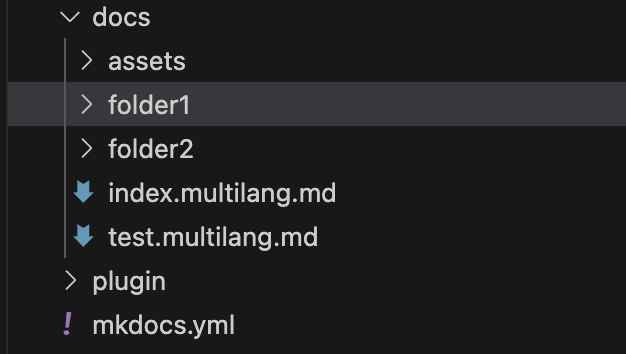
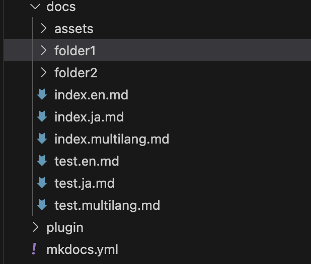

# MkDocs で言語切替を 1 つのファイルで行うためのプラグインをつくる

## 概要

MkDocs で言語切替を行う場合は、[mkdocs-static-i18n](https://github.com/ultrabug/mkdocs-static-i18n) を使用することが多いかと思います。  
mkdocs-static-i18n を使用することで簡単に言語切替を行うことができますが、言語ごとにファイルを用意する必要があります。  
複数ファイルがあると更新忘れが発生する可能性があるため、1 つのファイルで言語切替を行うプラグインを作成することにしました。

## 前提条件

以下の環境を前提とします。

- MkDocs の環境が構築済みであること
- mkdocs-static-i18n がインストール済みであること
- 環境は以下の通りです。
  - Python 3.12.3
  - MkDocs 1.6.0
  - mkdocs-static-i18n 1.2.3

また筆者は Python 経験がほぼなく、ChatGPT や GitHub Copilot に頼りながら Python実装を行いました。
そのため、Python のコードが冗長であったり、無駄な処理があるかもしれませんが、ご容赦ください。

## プラグインの仕様

利用者は、XXXX.multilang.md という拡張子が付いたファイルを作成し、そのファイル内に言語切替を行いたい文章を記述します。言語切替を行いたい箇所には、以下のようにコメントアウトを記述します。

```markdown
<!-- lang:ja -->

日本語の文章

<!-- lang:en -->

英語の文章

<!-- lang:common -->

日本語、英語どちらも共通の文章
```

そして mkdocs をビルドすると、もととなる XXXX.multilang.md と同じ階層に「XXXX.ja.md」「XXXX.en.md」 というファイルが自動生成されます。

## プラグインの作成

最初に、MkDocs がビルドしたタイミングで処理を行うプラグインを実装します。プラグインの作り方は以下の記事の通りに行うと作成できます。

- [プラグインを自作してみよう](https://mkdocs.nakaken88.com/plugin/create-your-plugin/)

1 点、記事の中では省略されていますが別途`setuptools`をインストールする必要があります。

```
pip install setuptools
```


## 言語切替の処理の実装

上記記事で作成した`sample.py`に、言語切替の処理を追加します。

まず`docs`フォルダに存在する、拡張子が`.multilang.md`のファイルを全て取得します。
ファイルを見つけたら、言語切替の処理を行う`separate_markdown`関数を実行します。

```python
class SamplePlugin(BasePlugin):
    def on_config(self, config):
        # /docsフォルダ内にある全てのフォルダ名を取得する
        for root, dirs, files in os.walk('./docs'):
            for file in files:
                if file.endswith(".multilang.md"):
                    file_path = os.path.join(root, file)
                    separate_markdown(file_path)
```

次に、`separate_markdown`関数を実装します。この関数は、`.multilang.md`ファイルを読み込み、コメントアウトされた言語ごとの文章を取得しします。そして言語ごとの文章を別々のファイルに書き込みます。

コードは以下の通りです。

<!-- separate_markdownの処理コード -->

詰まった点としては、言語ごとにファイルへ書き込むところで、最初は以下のように実装していました。

```python
# folder内に日本語と英語のコンテンツを書き出す
with open(file_path.replace('.multilang.md', '.ja.md'), 'w', encoding='utf-8') as file:
    file.write(japanese_content)
with open(file_path.replace('.multilang.md', '.en.md'), 'w', encoding='utf-8') as file:
    file.write(english_content)
```

この処理だと、プラグインが実行されるたびに、md ファイルの上書きが行われます。  
するとMkDocs 側で md ファイルの更新が発生したと判断され、再度ビルドが走る、という無限ループが発生してしまいます。
これを防ぐために、md ファイルが存在しない、もしくは md ファイル内の記述に変更があった場合のみ、ファイルへの書き込みを行うようにしました。

```python
# 日本語の内容を書き込む前に、既存のファイルの内容と比較します
ja_file_path = file_path.replace('.multilang.md', '.ja.md')
if not os.path.exists(ja_file_path) or open(ja_file_path, 'r', encoding='utf-8').read() != japanese_content:
    with open(ja_file_path, 'w', encoding='utf-8') as file:
        file.write(japanese_content)

# 英語の内容を書き込む前に、既存のファイルの内容と比較します
en_file_path = file_path.replace('.multilang.md', '.en.md')
if not os.path.exists(en_file_path) or open(en_file_path, 'r', encoding='utf-8').read() != english_content:
    with open(en_file_path, 'w', encoding='utf-8') as file:
        file.write(english_content)
```

以上で実装は完了です。

## 結果と考察

実装後、`mkdocs serve`を実行すると、multilang.md ファイルがあるフォルダに、言語ごとのファイルが生成されます。

<!-- 横並び -->

ビルド前  


ビルド後  



また multilang.md ファイルを更新して保存すると、言語ごとのmdファイルの中身も更新されます。

今回のプラグインを作成することで、通常の MkDocs を書いているときと同じ操作のまま、1 つのファイルで言語切替を行うことができました。これにより、複数ファイルを管理する手間が省けるため、更新漏れが発生する可能性が低くなります。

## その他詰まったところ
他の方に開発したプラグインを使ってもらおうとしたところ、プラグインをインストールする際にエラーが発生しました。
エラーの内容は以下のGitHubのissueと同様で、Permission denied と表示されました。

- [setup.py error: can't create or remove files in install directory (Windows & Ubuntu)](https://github.com/michaelgale/pcbflow/issues/3)

プラグイン作成で参考にした記事では`python setup.py develop`を実行して実装したプラグインをインストールしていましたが、この方法だと管理者権限が必要なディレクトリにインストールしようとするため、エラーが発生するようです。

この解決策として、プラグインをインストールする際に`python setup.py install --user`を実行することで、エラーを回避することができました。`--user`オプションをつけることで、管理者権限が不要なディレクトリにインストールされるためです。


## 参考文献

- [mkdocs で複数言語に対応する](https://fereria.github.io/reincarnation_tech_bk/10_Programming/99_Documentation/06_mkdocs_multi_lang/)
- [プラグインを自作してみよう](https://mkdocs.nakaken88.com/plugin/create-your-plugin/)
- [Python：pip における管理者権限と user install](https://pyteyon.hatenablog.com/entry/2019/05/24/003924)
- [setup.py error: can't create or remove files in install directory (Windows & Ubuntu)](https://github.com/michaelgale/pcbflow/issues/3)