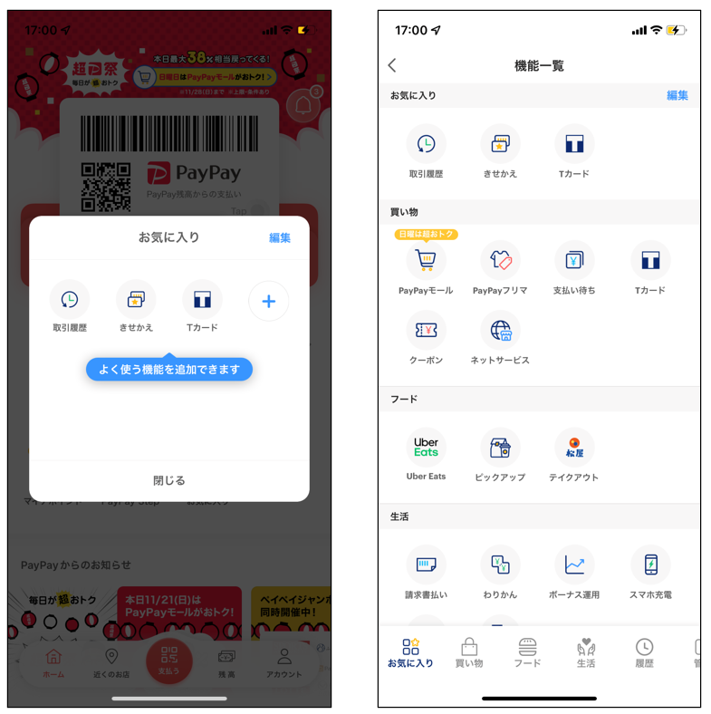
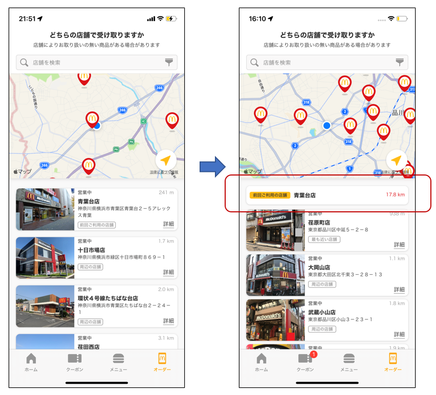

## はじめに

今回は「アプリノック」をやってみたので、そのやり方や結果について紹介していきます。

## アプリノックとは

「アプリノック」とは、多くのアプリのバージョンアップ前後の UI 変化を考察し Twitter 等で情報発信する活動です。一般的な用語ではなく、エン・ジャパンでアプリマーケティングを担当している宮﨑晃さん([@yositune12345](https://twitter.com/yositune12345))が個人で行っていたものです。
以下はその紹介記事ですので、気になる方は見てみてください。

- [アプリ担当者 Ch「アプリ UI/UX 道場〜アプリ 500 本ノックした宮﨑氏から学ぶ UI 改善のヒント〜」実施レポート](https://news.yappli.co.jp/n/n2440f8b3a21e)
- [アプリのアップデート 100 本ノックから学ぶ UI 改善のヒント](https://note.com/akira_miyazaki/n/n2a1c4ef230c3)
- [アプリのアップデート 300 本ノックから学ぶ UI 改善のヒント](https://note.com/akira_miyazaki/n/nb32211b94102)
- [400 個のアプリを見続けて学んだ「企画力を磨く 5 つの視点」](https://diginote.en-japan.com/n/n297084d1d0fb?magazine_key=me9177ae03cac)

## 動機

以前行っていた施策で UI デザイン作成を繰り返し行っていましたが、多く UI デザインを作っていると同じようなデザインばかりになると感じました。UI デザイン知識が乏しいので、自分が持っているデザインパターンの引き出しが少ない状態です。  
この引き出しを増やすために、アプリを深く観察するアプリノックが合っていると思い、実践してみることにしました。

## アプリノックのやり方

今回自分が実践したアプリノックのやり方を紹介します。

### アプリの選定

ユーザー数が多く、バージョンアップも頻繁に行っていそうなアプリを選びました。自分が普段使っているアプリの方が操作や重要な機能を把握しているので、観察する画面範囲を選びやすいと思います。  
以下は今回観察したアプリです。

- クラシル
- マクドナルド
- 食べログ
- ZOZO Town
- PayPay
- Dazn
- NetFlix

アプリは自動アップデートしないように、手動に変更しておきます。  
観察する画面は、そのアプリの重要な機能が表示されている画面や、ホーム画面にしました。その他に会員登録させるまでの動線の画面なども、変わることが多そうだったので記録するようにしました。(今回の期間では変化がありませんでしたが、、、)

### 記録の頻度

大体 1 週間に 1 度アプリの更新があればアップデートし画面キャプチャを取得しました。期間は 1 ヶ月だったので、変化が少なくても毎アップデート画面キャプチャを取得していましたが、結構大変なので大きな変化があったときだけ残しておくようにしても良いかもしれません。

### 画面キャプチャの保存先

今回はオンラインホワイトボードツールの[Miro](https://miro.com/)を使用しました。  
Miro にバージョンと各画面を貼り付けていきます。バージョンごとの UI の比較もしやすく、変化した点や気付きのメモも残しやすいので、ホワイトボードツールを使うことをおすすめします。 

 

## 考察結果

実際に変化した UI 画面を紹介します。

### ユーザが操作する際の迷いを少なくする

#### ●PayaPay
 
- 変化点  
    サービス一覧の中に赤枠部分の「お気に入り」という欄が追加された
- メリット  
    お気に入りのサービスを登録することで、ユーザが一覧から探すことなく目的のサービスを見つけることができる

ちなみに「お気に入り」を押下すると下図のような画面が表示され、お気に入りをカスタマイズすることができます。  
 

#### ●クラシル
 
- 変化点  
    - ヘッダーのカルーセル開始位置が左開始になった  
    - 名称が「レシピリスト」から「ホーム」に変わった。
- メリット  
    - カルーセルが一回転せず、左端が先頭で右端が末尾となったことで、タブがどこまであるのかわかりやすくなった
    - 「レシピリスト」という表現から「ホーム」に変わったことで、フッターメニューとの名称とも一致してユーザが現在の場所を知りやすくなった

ヘッダーのカルーセルが一回転できるシステムはよく見ますが、今回のように表示するメニューがいくつあるか推測できない場合(レシピリスト、ランキング、コラム、・・・、中華、洋食、スイーツ)は、先頭と末尾が明確になっている方が、ユーザの操作への不安も少なくなる気がしますね。  

また左開始となることで、情報に優先度も付けることができるため、新規で追加された目立たせたいメニューはホームの隣にしたりすることができます。下図では「レシピカード」が新規で追加されたとユーザが認識しやすくなっています。

 

#### ●マクドナルド
下図はモバイルオーダーした際の、受け取り店舗の選択画面です。
 
- 変化点  
    - 「前回ご利用の店舗」が一覧とは別で表示されている
- メリット  
    - いつも同じ店を利用しているユーザは、情報をよく見なくても店舗を選択できるようになった

左側の画面では「前回利用店舗」と「現在地から近い店舗」の表示の違いがほとんど無いため、ユーザにとっては上に地図が表示されていることもあり周辺の店舗が表示されていると誤解される可能性がありそうです。  
またいつも利用している店舗は実際に訪れているため、店舗外観の写真情報も不要と判断し表示していないのかもしれません。

### 情報は小分けし、見つけやすくする
#### ●NetFlix
下図はNetFlixのまもなく配信される作品など、注目作品を表示する画面です。
 
- 変化点  
    - フッターメニューが「まもなく配信」から「新着＆ホット」に変更
    - タブで表示内容を出しわけている
    - まもなく配信される作品の配信日が左側に表示されるようになった
- メリット  
    - ユーザが欲しい情報を見つけやすくなった

元々ホーム画面に「注目の作品」や「最も視聴された作品トップ10」が表示されていましたが、それらは何回かスクロールしないと表示されなかったりして、ユーザが見つけにくい状態になっていました。  
一画面で多くの情報を表示させるなら、タブで小分けにした方がユーザにとっては有難いですね。  

また個人的にNetFlixは黒を基調としていてスタイリッシュなイメージがあったので、ポップコーンなどの絵文字が使われているのは意外に感じました。「新着＆ホット」を見るユーザは新たな作品を探してワクワクしている状態だと思うので、そのテンションに合わせて絵文字を使用してるのかもしれません。

## アプリノックの感想
画面キャプチャを残しておくことで、普段使っていたらわからないような些細な変化を発見できて面白かったです。  
観察する上で、「この変更をすることでユーザにとって何が嬉しいか」「運営側はどういった狙いでこのような画面にしたのか」などを意識して見ると、変更した理由がなんとなく見えてくる気がしました。  
自分なりに変更された理由を考察することで、今後自分がデザインするときにも「デザインの意図」を伝えやすくなるのではと感じました。  

またそれとは別に、観察していくとUIデザインのトレンドも発見できると感じました。  
例えば「タブ」のデザインは、自分は下図のようなイメージがありました。  
 

しかし今回見た画面は下図のようにタブの動作を表現していました。  
 
タブメニューの選択中のボタンを塗りつぶすことで、現在表示しているページを表しています。Youtubeなども同様のデザインを採用しています。  
もちろん表示するコンテンツによって向き不向きはありますが、このようなタブだと境界線を追加する必要がないので、画面全体がスッキリした印象でスタイリッシュさがあります。  
こういった新たなデザインの発見が、デザインの引き出しを増やすことに繋がると思いました。

## まとめ
記事には書ききれなかったですが、細かいUI修正が発見でき結構楽しかったです。UI変更のメリットや狙いの他に、デメリットや自分ならどうするか等も考えると、さらに良いと感じました。

また1人でやらずに何人かでそれぞれアプリノックを行って意見を出し合う方がより多くの発見があると思うので、やってみたいという方がいらっしゃいましたらコメントや連絡のほどお願いします！！

